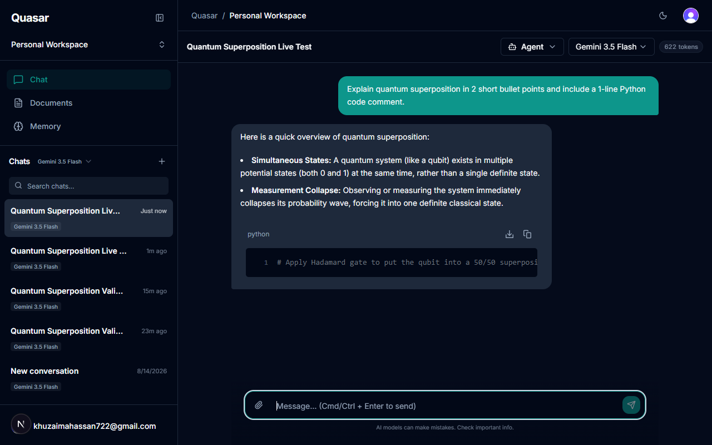
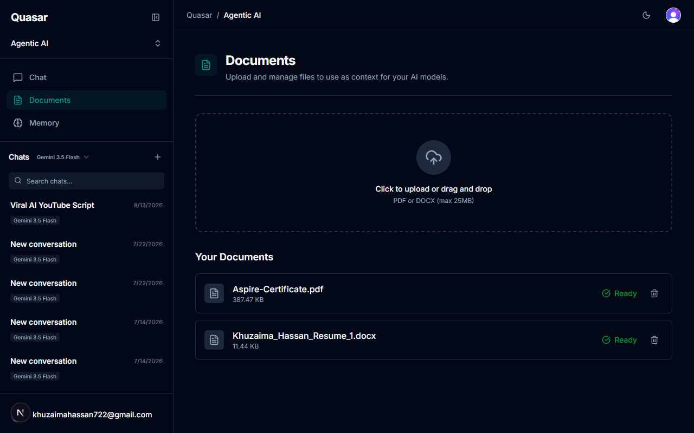
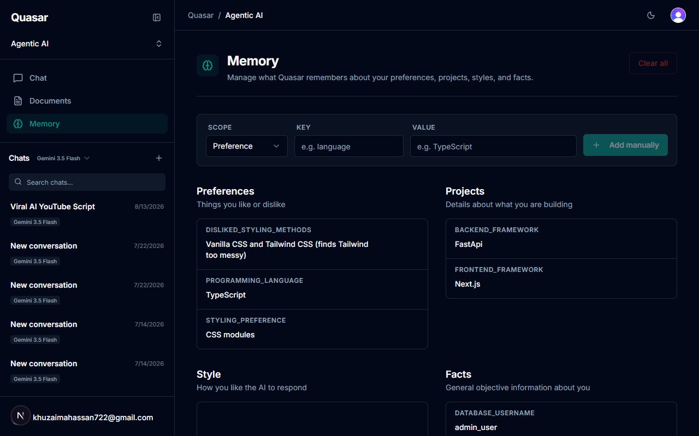
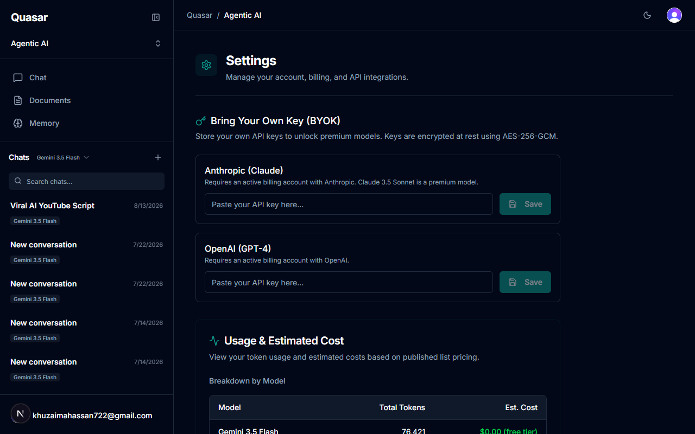
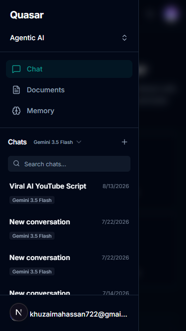

# Quasar

> **Production Full-Stack AI Developer Workspace** — featuring multi-model streaming chat, an end-to-end RAG document engine with cited sources, long-term memory extraction, and a human-in-the-loop multi-agent system capable of running tools and committing code to GitHub behind a verified approval gate.

**Live Demo:** [https://quasar-sand.vercel.app](https://quasar-sand.vercel.app)

> **Note on Backend Cold Starts:** The FastAPI RAG and agent service runs on Render's free tier, which spins down after 15 minutes of inactivity. The first document upload, retrieval, or agent execution after an idle period may take 30–60 seconds while the container initializes. Subsequent calls respond in milliseconds.

[](https://nextjs.org/)
[](https://react.dev/)
[](https://www.typescriptlang.org/)
[](https://clerk.com/)
[](https://fastapi.tiangolo.com/)
[](https://langchain-ai.github.io/langgraph/)

---

## What Quasar Does

Quasar is a production-deployed AI developer workspace demonstrating full-stack engineering discipline:

- **Stream Chat Across AI Providers** — Gemini 3.5 Flash (free default), Gemini 2.5 Pro, Claude Sonnet 5, and GPT-4o (unlocked via BYOK encrypted keys).
- **RAG Document Engine with Cited Sources** — Upload PDF or DOCX files, auto-chunk and embed into PostgreSQL (`pgvector`), and receive streaming answers backed by explicit source citations.
- **Autonomous Multi-Agent System** — LangGraph state machine (Planner, Coder, Reviewer) executing tools with a human-in-the-loop approval gate before committing validated changes to GitHub.
- **Long-Term Memory Extraction** — Automatically surface user preferences across sessions and inject relevant memory context into conversations.
- **Multi-Workspace Isolation** — Organize chats, documents, and agent runs across isolated workspaces with per-workspace security scoping.
- **Observability & Secret Protection** — Native LangSmith tracing with client-side secret redaction and pre-commit secret scanning hooks (`AES-256-GCM` key encryption at rest).

---

## Key Features

### ✅ Fully Implemented Stack (M1–M6)

- **Streaming Chat** — Real-time token streaming with Gemini 3.5 Flash (free default) or custom model selection per conversation.
- **Bring Your Own Key (BYOK)** — Gemini 2.5 Pro, Claude Sonnet 5, and GPT-4o unlocked by adding Anthropic/OpenAI keys in Settings; encrypted at rest with AES-256-GCM.
- **Full RAG Pipeline** — Upload PDF/DOCX → parse (PyMuPDF / python-docx) → chunk (500-token target, 60-token overlap) → embed (Gemini embedding-001, 768 dims) → store in pgvector → retrieve (cosine similarity + BM25 re-ranking via RRF) → inject context → cite sources in responses.
- **Document Library** — Per-workspace document management with live status polling (pending → processing → ready / failed) and clean Supabase Storage deletion.
- **Multi-Agent Execution** — LangGraph state graph running Planner/Coder/Reviewer nodes with human approval modal before code modification.
- **Memory Context Injection** — Extraction of long-term user preferences stored in Postgres and injected into relevant chat prompts.
- **Token & Cost Tracking** — Per-message token counts stored in database with running cost totals shown on the Settings analytics dashboard.
- **Multimodal Attachments** — Paperclip upload with presigned Supabase URLs; images passed directly as vision input; documents processed via RAG.
- **Authentication & Authorization** — Clerk email/OAuth authentication with database sync webhooks and strict row-level ownership checks.
- **Markdown & Code Rendering** — Streaming-aware markdown with syntax highlighting, line numbers, and one-click copy buttons via `streamdown`.
- **Responsive Layout** — Mobile drawer navigation and desktop sidebar accessible across all screen sizes.
- **Observability & Evals** — LangSmith tracing with client-side API key redaction (ADR-018) and automated RAG evaluation suite (`evals/run_evals.ts`).

---

## Screenshots

### Streaming Chat Interface


### Document Library & RAG


### Long-Term Memory & User Preferences


### Settings — BYOK API Key Management & Cost Analytics


### Responsive Mobile Drawer


---

## Architecture & Engineering Tradeoffs

For a complete record of the system architecture, component design, and explicit technical tradeoffs made throughout development (including features deliberately deferred and security vulnerabilities resolved), consult the Architecture Decision Records in [`docs/Decisions.md`](docs/Decisions.md).

### Documentation Index

| Document | Focus Area |
| :--- | :--- |
| [Architecture.md](docs/Architecture.md) | High-level system topology, service boundaries, and data flow |
| [AI-Pipeline.md](docs/AI-Pipeline.md) | LLM routing, Vercel AI SDK transport, and streaming setup |
| [RAG.md](docs/RAG.md) | Full RAG pipeline: parsing → chunking → embedding → hybrid search → citation |
| [rag-evaluation.prd.md](docs/rag-evaluation.prd.md) | Product specification and quality metrics for RAG evaluation |
| [Agents.md](docs/Agents.md) | LangGraph multi-agent architecture, MCP tool integration, and GitHub gate |
| [Memory.md](docs/Memory.md) | Long-term preference extraction, storage, and prompt injection |
| [Decisions.md](docs/Decisions.md) | Architecture Decision Records (ADRs) documenting major technical tradeoffs |
| [Database.md](docs/Database.md) | Prisma schema, pgvector setup, indexing, and query patterns |
| [API.md](docs/API.md) | Comprehensive API endpoint reference (Next.js & FastAPI) |
| [Security.md](docs/Security.md) | AES-256-GCM key encryption, route protection, and ownership rules |
| [Performance.md](docs/Performance.md) | Latency tracking, cold-start mitigation, and connection pooling |
| [Deployment.md](docs/Deployment.md) | Vercel frontend + Render backend production deployment guide |
| [Environment-Setup.md](docs/Environment-Setup.md) | Local development setup, Docker dependencies, and environment keys |
| [GitHub-Setup.md](docs/GitHub-Setup.md) | CI/CD pipeline, secret scanner hooks, and issue tracking |
| [Contributing.md](docs/Contributing.md) | Code style, pre-commit secret safeguards, and PR standards |
| [Roadmap.md](docs/Roadmap.md) | Complete 6-milestone feature backlog and implementation timeline |
| [Lessons-Learned.md](docs/Lessons-Learned.md) | Engineering reflections and operational lessons |

---

## Quick Setup & Local Development

### 1. Clone & Install Dependencies
```bash
git clone https://github.com/KhuzaimaHassan/Quasar.git
cd Quasar
npm install
```

### 2. Configure Environment Variables
Create `.env.local` in the project root. See [docs/Environment-Setup.md](docs/Environment-Setup.md) for required keys.

### 3. Run Local Servers
```bash
# Terminal 1 — Next.js Frontend
npm run dev

# Terminal 2 — FastAPI Backend (Python 3.11)
cd backend
uvicorn main:app --reload --port 8000
```

---

## Project Structure

```
src/
├── app/
│   ├── (auth)/               # Sign-in / sign-up pages (Clerk)
│   ├── (dashboard)/          # Protected workspace pages
│   │   ├── chat/             # Chat UI and conversation list
│   │   ├── documents/        # Document library and upload
│   │   ├── memory/           # Long-term preference memory
│   │   └── settings/         # BYOK API keys & cost dashboard
│   └── api/                  # Next.js API routes
│       ├── agents/           # Agent execution and human approval
│       ├── api-keys/         # BYOK key storage (AES-256-GCM)
│       ├── chat/             # Streaming chat handler (Vercel AI SDK)
│       ├── conversations/    # Conversation CRUD & attachments
│       ├── documents/        # Document upload URL & ingestion trigger
│       ├── memory/           # Memory preference extraction & retrieval
│       ├── workspaces/       # Workspace isolation CRUD
│       └── webhooks/clerk/   # Clerk user sync webhook
├── components/               # UI components (chat, layout, settings)
└── lib/                      # Models, encryption, DB client, queries

backend/                      # FastAPI RAG & Agent backend
├── main.py                   # Service entry point
├── routers/                  # API routers
│   ├── agents_run.py         # POST /agents/run — LangGraph engine
│   ├── ingest.py             # POST /ingest — RAG ingestion pipeline
│   ├── retrieve.py           # POST /retrieve — Hybrid RAG retrieval
│   └── health.py             # Healthcheck endpoint
├── agents/                   # LangGraph agent graphs
│   ├── main_graph.py         # Planner / Coder / Reviewer nodes
│   └── schemas.py            # Agent state schemas
├── tools/                    # Agent tools
│   ├── filesystem.py         # Target directory tools
│   └── github.py             # GitHub API integration
└── core/                     # Core services
    ├── parsing.py            # PyMuPDF & python-docx extraction
    ├── chunking.py           # Token-aware chunking
    ├── embeddings.py         # Gemini embedding-001
    ├── reranking.py          # BM25 + Reciprocal Rank Fusion
    ├── storage.py            # Supabase Storage client
    └── security.py           # Internal service secret validation

docs/                         # Architecture documentation & ADRs
prisma/                       # Prisma schema & migrations
evals/                        # RAG & prompt evaluation suite
```

---

## Milestone Execution & Status

| Milestone | Scope | Status |
| :--- | :--- | :--- |
| **M1 — Foundation** | Clerk Auth, Multi-Workspace, Database Schema | ✅ **100% Complete** |
| **M2 — Chat & BYOK** | Streaming Chat, AES-256-GCM BYOK, Attachments | ✅ **100% Complete** |
| **M3 — RAG Pipeline** | PDF/DOCX Parsing, pgvector Embeddings, Citations | ✅ **100% Complete** |
| **M4 — Memory** | Preference Extraction, Context Injection, Memory Page | ✅ **100% Complete** |
| **M5 — Agents** | LangGraph State Graph, MCP Tools, GitHub Human Gate | ✅ **100% Complete** |
| **M6 — Evals & Observability** | LangSmith Tracing (ADR-018), Evals Suite, Cost Analytics | ✅ **100% Complete** |

> **Notes on Deferred Scope:** Features #92 (Local WebGPU/Ollama execution), #93 (Elasticsearch hybrid search), and #108 (Sentry error tracking) were evaluated and deliberately deferred in favor of pgvector RRF re-ranking and native LangSmith tracing. Details are documented in [ADR-018](docs/Decisions.md#adr-018-client-side-langsmith-tracing-redaction) and [ADR-019](docs/Decisions.md#adr-019-observability-langsmith-vs-sentry).

---

## Engineering Principles

- **No Secret Leaks** — All API keys encrypted with AES-256-GCM at rest; pre-commit secret scanner hook (`scripts/scan-secrets.mjs`) enforces zero-credential commits.
- **Fail Fast & Explicitly** — Invalid API keys, unauthenticated routes, or broken external calls return structured HTTP error responses with zero silent swallowing.
- **Empirical Verification** — Every feature, API route, and security measure validated with automated execution and empirical proof.
